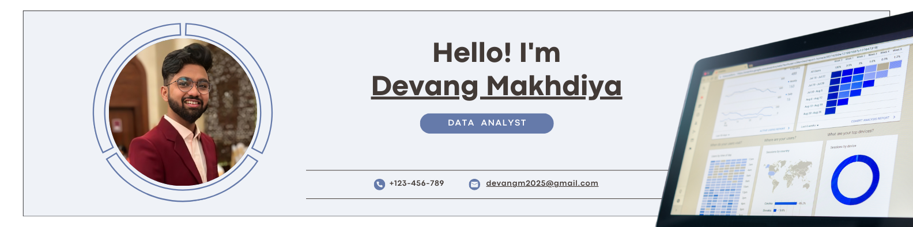

# Devang Makhdiya | Data Analyst & BI Specialist  

**Data-driven decisions start with precision.**  

  

## 👋 Profile  
I'm a Data Analyst with expertise in transforming raw data into actionable insights. With a Master's in IT Management from UT Dallas and a B.Tech in Computer Science, I've delivered impact across industries in the U.S., UAE, and India through advanced analytics, automation, and BI solutions.

---

## 🛠 Core Skills  
**▸ Data Analysis:** Python (Pandas, NumPy), SQL, R  
**▸ Visualization:** Power BI, Tableau, Matplotlib/Seaborn  
**▸ ETL & Databases:** Azure, AWS, MySQL, SSIS  
**▸ Business Intelligence:** Salesforce CRM, Financial Analytics  
**▸ Modeling:** Regression, Clustering, Forecasting  

---

## 💻 Experience Highlights  

### **Auramedpro Inc.** | Dallas, TX  
*Data Analyst – Salesforce & BI (2023-Present)*  
- Boosted Salesforce data accuracy by 40% through validation rules  
- Built Power BI dashboards improving decision speed by 30%  
- Automated financial reporting using SQL stored procedures  

### **Elfit Arabia** | Dubai, UAE  
*Data Analyst & IT Developer (2020-2022)*  
- Designed ETL pipelines increasing system efficiency by 40%  
- Developed lead-gen dashboards improving conversions by 20%  

### **Phani Foods** | Hyderabad, India  
*Director of Business Development (2018-2020)*  
- Reduced inventory waste 25% via demand forecasting  
- Grew revenue 50% through customer segmentation  

---

## 🚀 Key Projects  
**Pet Clinic ETL System**  
- Created MySQL-based pipeline handling 50K+ daily records  
- Achieved 93% data accuracy with automated cleansing  

**COVID-19 Dashboard**  
- Scraped/analyzed CDC data using Python  
- Built Tableau dashboards tracking regional outbreaks  

---

## 🎓 Education  
**MS IT Management** | UT Dallas (2023)  
**B.Tech Computer Science** | BITS Dubai (2018)  

---

## 📜 Certifications  
- Microsoft Power BI Data Analyst  
- Tableau Certified Analyst  
- Salesforce Administrator  

---

## 📬 Connect  
📍 Dallas, TX  
📧 devangm2025@gmail.com  
🔗 [linkedin.com/in/devangmakhdiya](https://www.linkedin.com/in/devangmakhdiya)  

*"Translating data into direction. Elevating analytics into action."*  
